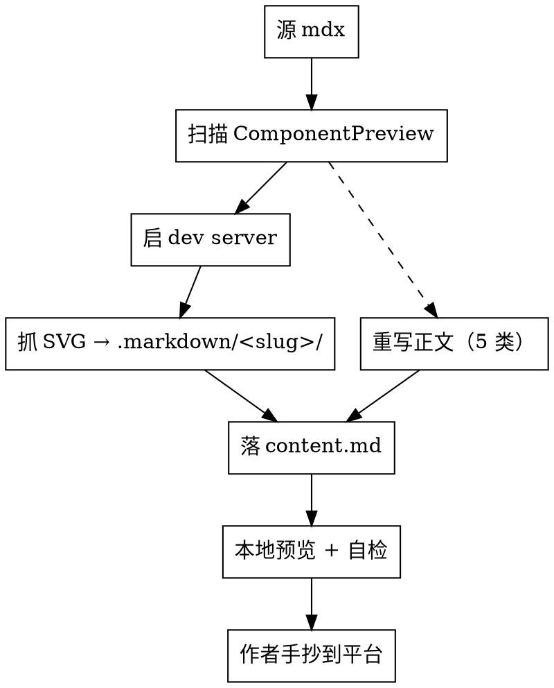

# retikz blog 文章外站发布规范

## 使用时机

把一篇已写好的 blog 文章（`apps/docs/src/contents/blog/<section>/<slug>/index.{zh,en}.mdx`）转换为可直接贴到掘金 / 公众号 / 知乎等平台的 markdown + 配套 SVG 时使用。

**前置依赖**：先读 [`docs-doc-blog`](../docs-doc-blog/SKILL.md)——本 skill 假设文章已按那套规范写好（ComponentPreview 前后有点题句、`## 引用` 节齐全、双语对齐等），转换步骤依赖这些不变量。

## 输入与输出

| 项 | 内容 |
|---|---|
| 输入 | `apps/docs/src/contents/blog/<section>/<slug>/index.<lang>.mdx`（`lang` ∈ `zh` / `en`，默认 `zh`） |
| 输出根 | `.markdown/<slug>/`（仓库根下的隐藏目录，**不进 git**，加 `.gitignore`） |
| 输出文件 | `content.md`（正文） + `<demo-name>.svg`（每个 ComponentPreview 一份）<br />双语并行时 `content.zh.md` / `content.en.md` 并存，SVG 共用同目录 |

输出目录**扁平**——所有 SVG 与 `content.md` 同级，方便整目录拖到掘金编辑器或一次性上传图床。

## 总流程



## SVG 抓取

retikz 的渲染依赖 DOM 文本测量（`packages/react/src/render/browser-measurer.ts`），SSR / jsdom 不可靠——SVG 必须从浏览器渲染好的 DOM 里抓。

走 **Node 22 自带 WebSocket + 系统 Edge/Chrome headless 经 CDP 抓** 这条零依赖自动化路径，配套脚本 [`grab-svg.mjs`](./grab-svg.mjs) 同目录已备好。

### 前置

| 项 | 要求 |
|---|---|
| Node | ≥ 22（要原生 WebSocket） |
| 浏览器 | 系统装了 Edge 或 Chrome 任一即可（脚本按平台自动定位；Windows / macOS / Linux 各几条默认路径） |
| dev server | `pnpm --filter @retikz/docs dev` 已起，记下实际端口（5173 被占时会自动换 5174 等） |
| demo 离线色 | 见下面「离线色坑」节，需要先扫 |

### 步骤

```bash
# 1. 起 dev server（后台）
pnpm --filter @retikz/docs dev &

# 2. 等 server 起来后抓 SVG（替换 URL 端口、out 目录、demos 列表）
node .agents/skills/docs-blog-conventor/grab-svg.mjs \
  --url http://localhost:5174/blog/<section>/<slug> \
  --out .markdown/<slug> \
  --demos demo1,demo2,demo3
```

`--demos` 按 mdx 里 `<ComponentPreview name="...">` 的**出现顺序**填，逗号分隔；脚本按 DOM 卡片顺序与之一一对应、写出 `<name>.svg`。

抓 SVG 的来源 demo——`ComponentPreview` 自身按 i18n 解析：优先 `<name>.<lang>.demo.tsx`，缺则回落 `<name>.demo.tsx`（见 `ComponentPreview.tsx` 的 `resolveDemoKey`）。zh 页打开抓的就是 zh 版 SVG，en 同理；双语都要发就切两次语言各抓一次。

### 同名 demo 去重

同篇文章里 `<ComponentPreview name="X" />` 出现两次（hideCode 与否不影响）只抓一次 SVG，正文两处都引用同一个 `./X.svg`；`--demos` 列表里 X 只列一次。

### 离线色坑

retikz demo 里若用了 CSS var（如 `var(--foreground)`、`hsl(var(--primary))`）作 `stroke` / `fill`，SVG 离开 docs 站的 CSS context 后变量解析不到，会 fallback 成黑或透明。

抓 SVG 前**扫一眼 demo 源码**：

| 模式 | 状态 |
|---|---|
| 字面色 `red` / `dodgerblue` / `darkorange` / `gray` / `lightgray` / `dimgray` / `#ef4444` / `oklch(0.55 0.16 145)` | ✅ 离线可用 |
| `var(--foreground)` / `hsl(var(--primary))` 等 token | ❌ 离线变黑 |
| `currentColor` | ⚠️ 取决于 SVG 外层是否有 color；下载后通常变黑 |

发现 token / currentColor——回去把 demo 改字面色（学 `unit-circle.zh.demo.tsx` 顶部的 `HELP_LINE` / `SIN_COLOR` 等本地常量）再抓。这一改顺带利好原 demo 在离线场景下的复用能力，应当顺手提 PR。

### 脚本不可用时的兜底（人工 Download SVG）

`grab-svg.mjs` 跑挂或环境不满足（如无 Edge / Chrome、Node < 22）时，手抓也走得通：
浏览器打开文章页 → 对每个 ComponentPreview hover 卡片右下角 → 点 **Download SVG** → 挪到 `.markdown/<slug>/`。文件名脚本自动用 `name` prop，与自动化路径一致。

## 正文重写（5 类改写）

输入是 mdx，输出是平台通吃的 markdown。逐类改：

### 1) frontmatter 剥离 + H1 / 副标题提升

mdx 顶部的 `---...---` 块**整块删**——掘金 / 公众号 / 知乎都不识别，留着会作为正文显示出来。

剥掉后把 `title` 提为 H1、`description` 化为引言段：

```mdx
<!-- 源 mdx -->
---
title: retikz 的起点
description: retikz 项目的起点与定位
date: 2026-05-17
tags: [设计, 起点]
---

## retikz 的成果
```

```markdown
<!-- 输出 content.md -->
# retikz 的起点

> retikz 项目的起点与定位

## retikz 的成果
```

`date` / `tags` 不进正文——单独落到文末「平台元数据」节（见下文「4) 文末平台元数据节」）。

### 2) ComponentPreview → markdown 图片

每个 `<ComponentPreview name="X" ... />` 替换为：

```markdown

```

- **alt 文本**取附近点题句。docs-doc-blog 要求 ComponentPreview 前后必有一句"它在演示什么"，把那句**压缩为 10-30 字**当 alt 用
- `size` / `hideCode` / `align` 等 prop 全部丢弃——markdown 图片没这套配置
- 同名 demo 多处出现时图片路径一致（`./X.svg`），不复制 SVG

例（origin 文章）：

| 源 mdx | 输出 markdown |
|---|---|
| `<ComponentPreview name="unit-circle" size="lg" />` | `` |
| `<ComponentPreview name="ir-centric" hideCode />` | `` |
| `<ComponentPreview name="roadmap" hideCode />` | `` |

### 3) 站内路径全部绝对化

文档站走 react-router `BrowserRouter` + GitHub Pages 部署，部署 base 是 `https://pionpill.github.io/retikz/`。站内任何 `/...` 开头的链接都要前缀部署 URL：

| 源 mdx 链接 | 输出 markdown 链接 |
|---|---|
| `[karl-circle 示例](/core/examples/karl-circle)` | `[karl-circle 示例](https://pionpill.github.io/retikz/core/examples/karl-circle)` |
| `[retikz 核心理念](/blog/design/core-philosophy)` | `[retikz 核心理念](https://pionpill.github.io/retikz/blog/design/core-philosophy)` |

**覆盖范围**：正文 inline link + `## 引用` 节里的所有站内链接都要改。外部链接（GitHub、TikZ 官网、pionpill.github.io/article 等）保持原样。

**别瞎猜 base URL**——只用 `apps/docs/AGENTS.md` 与根 `AGENTS.md` 里登记的 `https://pionpill.github.io/retikz/`；不要凭训练数据想象（旧域名 / 旧仓库名等）。

### 4) 站内表述重述

文章里凡是引用站内 UI 元素 / 站内功能的句子，要补"retikz 官方文档站"前缀，让外站读者明白指代对象：

| 源句（站内视角） | 输出句（外站视角） |
|---|---|
| "demo 卡片右上角的 **Ask AI** 按钮" | "retikz 官方文档站（https://pionpill.github.io/retikz/）的 demo 卡片右上角有 **Ask AI** 按钮" |
| "站内 Ask AI 让读者把任意 demo 喂给 AI 改图" | "retikz 站点的 Ask AI 功能让读者把任意 demo 喂给 AI 改图" |
| "站内搜索 / 全站搜索 / 侧边栏 / 右上角语言切换" | 全部加 "retikz 官方文档站" 限定语 |

**常见 trigger 词**——`站内` / `本站` / `demo 卡片` / `右上角` / `侧边栏` / `TOC` / `全文搜索` / 任何描述 UI 位置的句子。

`llms.txt` / `Markdown 导出` / `IR JSON 视图` 这类**功能名**保留原样，但首次提到时加一句"retikz 站点提供的"，避免外站读者不知道在说什么。

### 5) `<Comparison>` / 其他 docs JSX 内联展开

origin 文章未用 `<Comparison>`，其他文章可能用。统一处理：

| mdx 元素 | 输出处理 |
|---|---|
| `<Comparison target="..."`>` | 把对比要点**用一句话内联到正文**（docs-doc-blog "跨平台手抄" 节已要求作者写好这句） |
| `<ZodSchema>` / `<ExamplePrompt>` | blog 不该出现——出现了说明作者违反 docs-doc-blog，回去问；不要在本 skill 里硬转换 |
| `<br />` 在表格里 | 保留——掘金 / 公众号 / 知乎的 markdown 表格都支持 |
| ` ```tsx` / ` ```ts` / ` ```bash` 等代码块语言标识 | 保留——主流平台都支持 |

## 文末平台元数据节

`content.md` 末尾追加一节，方便作者复制到掘金 / 公众号的封面 / 摘要 / tag 字段（**不是给读者看的，是给作者发布时填表用的**）：

```markdown
---

<!-- 平台元数据（手抄到掘金 / 公众号 / 知乎的封面 / 摘要 / 标签字段；正文不显示） -->

- **标题**：retikz 的起点
- **摘要**：retikz 项目的起点与定位
- **发布日期**：2026-05-17
- **标签**：设计 / 起点
- **原文链接**：https://pionpill.github.io/retikz/blog/journey/origin
```

注意：

- 用 HTML 注释包裹标签段头，避免有些平台把 `平台元数据` 当成正文标题
- **原文链接**字段是新加的——外站发布时礼貌指回原站点，掘金等平台也支持 canonical URL 设置
- 这节走 `---`（hr）与正文隔开

## 落 content.md

把上述 5 类改写产物按文章原顺序拼成 `content.md`：

```
# 标题（来自 frontmatter title）

> 副标题（来自 frontmatter description）

<正文 H2 节按原序>

---

<!-- 平台元数据... -->
- **标题**: ...
- **摘要**: ...
- **发布日期**: ...
- **标签**: ...
- **原文链接**: ...
```

## 验证（落盘前自检）

```bash
# 输出目录结构
ls .markdown/<slug>/
# 期望：content.md + 每个 <ComponentPreview name="X"> 对应一份 X.svg
```

正文扫一遍：

| 检查项 | 通过条件 |
|---|---|
| frontmatter `---...---` 块 | 已剥除 |
| 第一行 | `# <标题>` |
| 任意 `<ComponentPreview` / `<Comparison` / `<ZodSchema` / `<ExamplePrompt` 残留 | 0 处 |
| 任意 `](/`（站内绝对路径） | 0 处——全部替换为完整 URL |
| 每个 SVG 引用 `` | `.markdown/<slug>/X.svg` 存在 |
| 文末平台元数据节 | 含 标题 / 摘要 / 发布日期 / 标签 / 原文链接 5 项 |
| `## 引用` 节里站内链接 | 已绝对化 |

正则速查：

```bash
# 残留 mdx JSX 标签
grep -nE '<(ComponentPreview|Comparison|ZodSchema|ExamplePrompt)' .markdown/<slug>/content.md

# 残留站内绝对路径
grep -nE '\]\(/(blog|core|about)/' .markdown/<slug>/content.md
```

两条都应该 0 行输出。

## 本地预览

`content.md` 在 VSCode 的 markdown preview / `pnpm dlx markdown-cli --watch` 里打开过一遍，**模拟外站读者最差视图**：

1. SVG 是否都加载出来（路径错 / 抓漏）
2. 所有 inline link 鼠标 hover 是否是完整 URL
3. 代码块语法高亮是否生效
4. 表格 `<br />` 软断是否符合预期
5. 段落节奏（docs-doc-blog 要求 ≤ 3 行）保持

## 发布步骤建议（手抄环节）

`content.md` + SVG 备好后，**手抄到掘金**的标准流程（公众号 / 知乎大同小异）：

1. 进掘金「创作中心 → 写文章」，切到 **Markdown 编辑模式**
2. 把 `content.md` 内容**整体粘进编辑器**——掘金会自动渲染图片占位
3. **逐张上传 SVG**：图片占位会显示「图片加载失败」；点占位 → 上传 → 选 `.markdown/<slug>/X.svg`；掘金自动把 `./X.svg` 替换为图床 CDN URL
4. 在右栏填封面 / 摘要 / 标签——从「平台元数据」节复制
5. 设置「原文链接」字段（canonical URL）= 平台元数据里的「原文链接」
6. **预览**——掘金预览页过一遍，确认所有图都加载、所有链接可点

**SVG 在 markdown 里直接贴 file:// 路径或相对路径在掘金正文里无法显示**——掘金正文只接图床 / CDN URL，必须先上传换 URL。这是为什么输出结构把 SVG 同级放——拖文件夹时一次性传完。

## `.gitignore`

`.markdown/` 是手抄中间产物，不该进 git。仓库根 `.gitignore` 加：

```
.markdown/
```

如果根 `.gitignore` 已存在，去重后追加这一行即可。

## 双语并行

文章双语都要发时，分别走一遍（zh / en）。SVG 是按 demo 语言抓的，所以两份语言的 SVG 内容可能不同（如果 demo 里有 `text` 文字差异），同放 `.markdown/<slug>/` 时按需重命名避免覆盖：

| 模式 | 输出 |
|---|---|
| 纯几何 demo（无文字差异，单 `.demo.tsx`） | 共用一份 `X.svg` |
| 文字 demo（双语 `.zh.demo.tsx` / `.en.demo.tsx`） | 两份独立 `X.zh.svg` / `X.en.svg`，content.{zh,en}.md 各自引用对应版 |

判断方式：看 demo 文件存不存在 `.<lang>.demo.tsx` 副本——存在则双语 SVG 不同，分文件名；不存在则共用单 SVG。

## Common Mistakes

- **frontmatter `---...---` 块漏剥** —— 整块连同 `---` 分隔符贴进掘金，平台会作为正文显示
- **`<ComponentPreview>` 没改成 markdown 图片** —— 外站不识别 JSX；不能保留原 tag
- **alt 文本写 `图片` / `示例` / `demo 名`** —— 失去 a11y + 失去手抄场景下"看不到图也能读"的可读性下限；alt 取 docs-doc-blog 要求的点题句
- **站内 `/blog/...` / `/core/...` 链接没绝对化** —— 外站点击 404
- **`https://pionpill.github.io/retikz/` base URL 凭印象写错**（如写成 `retikz.doc` 旧路径、域名换 `Pionpill` 而非 `pionpill`）—— 永远从 `apps/docs/vite.config.ts` 的 `base` 字段或 `AGENTS.md` 抄，不要凭训练数据
- **站内 UI 表述没重述** —— "demo 卡片右上角的 Ask AI 按钮"直接贴外站读者懵
- **`var(--foreground)` 类 CSS token 直接抓 SVG** —— 离线变黑；先改 demo 用字面色
- **没扫同名 demo 复用** —— 把同一份 SVG 复制成多个文件，污染目录
- **掘金正文直接贴本地 file:// 路径** —— 掘金正文只接 CDN URL；必须先上传换 URL
- **抓 SVG 切错语言** —— zh 页面下抓出来的是 zh demo SVG，en 文章引用就字对不上；按目标语言切站点语言再抓
- **改 `grab-svg.mjs` 改成挂 Playwright / Puppeteer 之类的依赖** —— 已是 Node 22 + 系统 Edge 的零依赖路径；想加是因为没读完脚本
- **`--demos` 列表顺序错** —— 必须按 mdx 里 `<ComponentPreview name="...">` 的**出现顺序**填；DOM 顺序与文章顺序一致，错位会让 unit-circle.svg 被写成 ir-centric 的内容
- **`.markdown/` 没进 `.gitignore`** —— 手抄产物入仓污染历史
- **文末平台元数据节漏「原文链接」字段** —— 外站搜索引擎拿不到 canonical URL，会被认作站内重复内容

## 与 docs-doc-blog 的关系

| | docs-doc-blog | 本 skill |
|---|---|---|
| 用途 | 在 mdx 里**写**一篇符合规范的 blog 文章 | 把已写好的 mdx **转**为外站可贴 markdown |
| 触发时机 | 起一篇新 blog / 改正文 | 文章定稿 / 要发到掘金 / 公众号时 |
| 输入 / 输出 | 输入需求与提纲，输出 `index.{zh,en}.mdx` + `<name>.demo.tsx` | 输入 mdx + demo，输出 `.markdown/<slug>/content.md` + SVG |
| 关键不变量 | ComponentPreview 前后点题句、`## 引用` 节、frontmatter 4 字段 | 依赖以上不变量做转换；缺哪条**回去**让作者补，本 skill 不补 |

docs-doc-blog 是写作端的规范，本 skill 是发布端的规范，**不替代**——一篇文章可能只写不发（站内自足就行）；要发就过本 skill。
