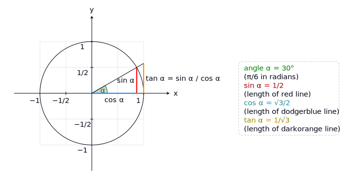
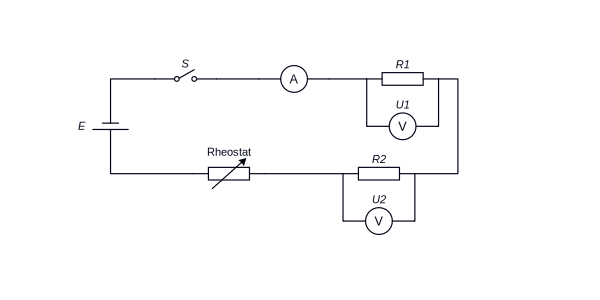

# retikz

[English](./README.md) | [简体中文](./README.zh.md)

> retikz is an AI-native, IR-first diagram primitive library. It ships official React and vanilla-JavaScript APIs, inspired by TikZ.

[](https://www.npmjs.com/package/@retikz/react)
[](./LICENSE)
[](https://pionpill.github.io/retikz/)
[](https://react.dev/)
[](https://bundlephobia.com/package/@retikz/react)

retikz is built around a durable JSON IR, not around any single UI framework. React (`@retikz/react`) and vanilla JavaScript (`@retikz/vanilla`) are the two officially maintained APIs today, while Vue, Svelte, or other runtimes can integrate by producing the same IR or by building thin adapters on top of `@retikz/core`.

It is not another chart template library. Think of it as a drawing foundation for relationship diagrams, technical explanations, geometric sketches, annotated figures, and AI-generated or AI-edited diagrams.

## Why retikz?

<p align="center">
  
</p>

retikz's architecture starts with one durable drawing contract: Sugar JSX, Kernel JSX, future text DSLs, plain JavaScript objects, Vue or other framework adapters, and AI output can all converge into the same JSON IR before rendering.

- **IR is the core product**: persist diagrams, validate them with schema, replay them later, and render them through any compatible adapter.
- **AI-friendly by design**: LLMs can generate schema-constrained JSON IR or patch existing diagrams without writing brittle JSX strings.
- **Official React and vanilla-JS authoring entries, framework-neutral core underneath**: `@retikz/react` and `@retikz/vanilla` are the officially maintained authoring entries; `@retikz/core` has no React or DOM dependency.
- **TikZ-inspired vocabulary**: use proven ideas like nodes, paths, anchors, and scopes without needing to know LaTeX or TikZ first.

## AI-friendly by design

AI friendliness is not an add-on. It is the reason the IR exists.

| Design choice | Why it matters |
| --- | --- |
| JSON-only IR | Models can emit structured data instead of source code text |
| Schema-backed fields | Runtime validation catches invalid diagrams early |
| Patchable document shape | AI can edit a small part of a diagram without rewriting the whole figure |
| Framework-neutral contract | Human JSX, native JS objects, future Vue adapters, and AI output can share one drawing format |

## See it in action

### Karl's unit circle

This example shows the TikZ-like primitive layer: grid, axes, anchors, labels, arrows, sectors, and paths are composed directly into a precise mathematical figure.

<p align="center">
  
</p>

Example: [Karl's Unit Circle](https://pionpill.github.io/retikz/core/examples/karl-circle) · [source](./apps/docs/src/contents/core/examples/karl-circle/karl-circle-07-info.en.demo.tsx)

### Ohm's law circuit

This example shows the encapsulation path for product and business diagrams: custom circuit symbols are packaged as reusable components, then duplicated and positioned with `Scope`.

<p align="center">
  
</p>

Example: [Ohm's Law Circuit](https://pionpill.github.io/retikz/core/examples/ohms-law-circuit) · [source](./apps/docs/src/contents/core/examples/ohms-law-circuit/ohms-law-circuit-06-labels.en.demo.tsx)

## Quick start

Install the current official React adapter and React peer dependencies:

```bash
pnpm add @retikz/react react react-dom
```

Draw a small named-node diagram:

```tsx
import { Draw, Layout, Node } from '@retikz/react';

export const Example = () => (
  <Layout width={420} height={120}>
    <Node id="idea" position={[0, 0]}>
      Idea
    </Node>
    <Node id="ir" position={[110, 0]}>
      JSON IR
    </Node>
    <Node id="svg" position={[230, 0]}>
      SVG
    </Node>

    <Draw way={['idea', 'ir', 'svg']} arrow="->" />
  </Layout>
);
```

Prefer not to use React? The official `@retikz/vanilla` package offers an imperative named builder plus `mountSvg` / `mountCanvas` (SSR included):

```ts
import { figure, node, draw } from '@retikz/vanilla';

const fig = figure([
  node('idea', { position: [0, 0], text: 'Idea' }),
  node('ir', { position: [110, 0], text: 'JSON IR' }),
  node('svg', { position: [230, 0], text: 'SVG' }),
  draw(['idea', 'ir', 'svg'], { arrow: '->' }),
]);

fig.mount(document.querySelector('#diagram')); // also: fig.toSvgString() / fig.toCanvas(canvas)
```

Open the [Quick Start](https://pionpill.github.io/retikz/core/get-start) to build the same idea step by step, or jump into the [examples](https://pionpill.github.io/retikz/core/examples/karl-circle).

One level deeper, the stable boundary is the IR: create JSON IR directly with plain JavaScript, or build another framework adapter that emits the same IR, then compile it with `@retikz/core`.

## What you can draw today

retikz 0.3 focuses on general diagram primitives, now with multi-backend rendering, animation, and interactivity:

| Capability | What it gives you |
| --- | --- |
| Named nodes and coordinates | Stable references for later paths and edits |
| Paths, steps, arrows, and edge labels | Relationship lines that attach to anchors instead of raw text centers |
| Scopes and transforms | Grouping, local movement, rotation, scale, and inherited style |
| Shapes, fills, and registries | Built-in shapes plus extensible shapes, arrows, patterns, and path generators |
| JSON IR and Scene output | A portable contract for persistence, AI editing, and multiple renderers |
| Multi-backend rendering (SVG / Canvas 2D) | The same IR compiles to either an SVG or a Canvas 2D backend |
| Animation | Declare animations on `<Layout>`, played by both SVG and Canvas backends; freeze a static frame for SSR poster shots |
| Interactivity, events, and hydration | Node / path events and hit-testing; hydrate on the client after SSR |
| Framework-free / SSR | `@retikz/vanilla`'s `mountSvg` / `mountCanvas` and `renderToSvgString` |

Data-driven charts are handled by the emerging Tier 2 layer `@retikz/plot` (a standalone package, currently alpha); for flow layout, codecs, and additional render targets, see the [roadmap](https://pionpill.github.io/retikz/about/releases/roadmap).

## Architecture

```text
React JSX / plain JS objects / future DSL / AI JSON
  -> retikz IR
  -> compileToScene()
  -> Scene primitives
  -> @retikz/render: SVG / Canvas 2D (mounted via react / vanilla)
```

The important design choice is that React JSX is only one input format. Once a diagram becomes IR, the same data can be saved, validated, patched by an LLM, compiled, and rendered by any compatible adapter.

| Integration path | Status |
| --- | --- |
| React components via `@retikz/react` | Official API |
| Framework-free imperative mounting via `@retikz/vanilla` (incl. SSR) | Official API |
| Plain JavaScript or TypeScript IR objects | Supported at the `@retikz/core` boundary |
| SVG / Canvas 2D render backends (`@retikz/render`) | Available |
| Vue / Svelte / other framework adapters | Architecturally intended, not packaged yet |
| native / PDF renderers | Future renderer direction |

## Packages

| Package | Role | Runtime dependencies |
| --- | --- | --- |
| [`@retikz/core`](https://www.npmjs.com/package/@retikz/core) | Framework-neutral JSON IR, schemas, pure parsers, and the IR-to-Scene compiler | `zod` |
| [`@retikz/render`](https://www.npmjs.com/package/@retikz/render) | Scene render-backend namespace: `./svg` (Scene → SVG descriptor / string), `./canvas` (Scene → Canvas 2D), plus animation and hydration runtimes | `@retikz/core` |
| [`@retikz/react`](https://www.npmjs.com/package/@retikz/react) | Official React components and JSX-to-IR builder, mounting both SVG and Canvas backends | `@retikz/core`, `@retikz/render`, peer `react >=18` |
| [`@retikz/vanilla`](https://www.npmjs.com/package/@retikz/vanilla) | Official framework-free runtime: imperative `mountSvg` / `mountCanvas`, `renderToSvgString` (SSR), and a named builder | `@retikz/core`, `@retikz/render` |

The four Tier 1 packages — core / render / react / vanilla — ship in lockstep under the same version.

## Project status

The current development line is `0.3`: on top of the v0.2 stable base it adds `@retikz/render` (SVG / Canvas 2D backends), `@retikz/vanilla` (framework-free runtime + SSR), and animation and interactivity. The previous stable npm line is `0.2.0`.

retikz is still pre-1.0, so API details may change before the first stable major release. Breaking changes are documented in the [versioning guide](https://pionpill.github.io/retikz/about/releases/versioning) and release notes.

## Development

```bash
pnpm install
pnpm lint
pnpm test
pnpm build
pnpm dev:docs
```

Useful links:

- [Documentation](https://pionpill.github.io/retikz/)
- [Introduction](https://pionpill.github.io/retikz/core/introduction)
- [Source code guide](https://pionpill.github.io/retikz/about/developer/source-code-guide)
- [Roadmap](https://pionpill.github.io/retikz/about/releases/roadmap)
